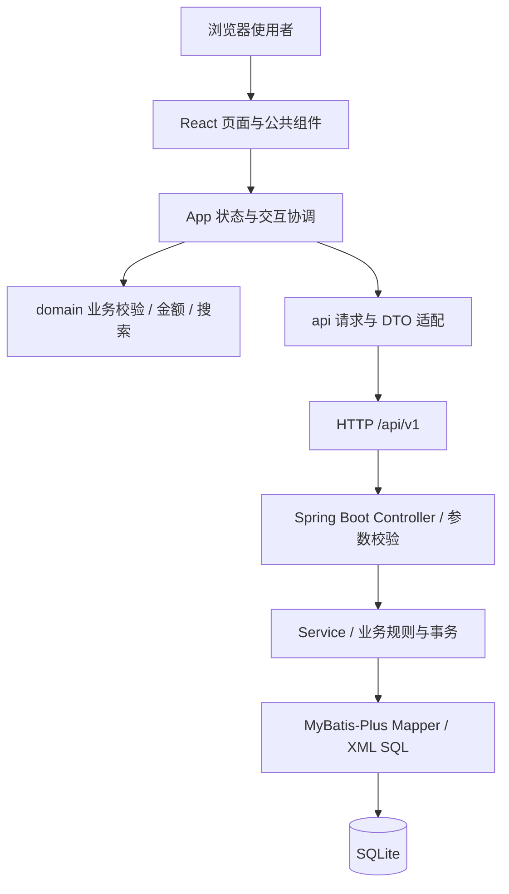
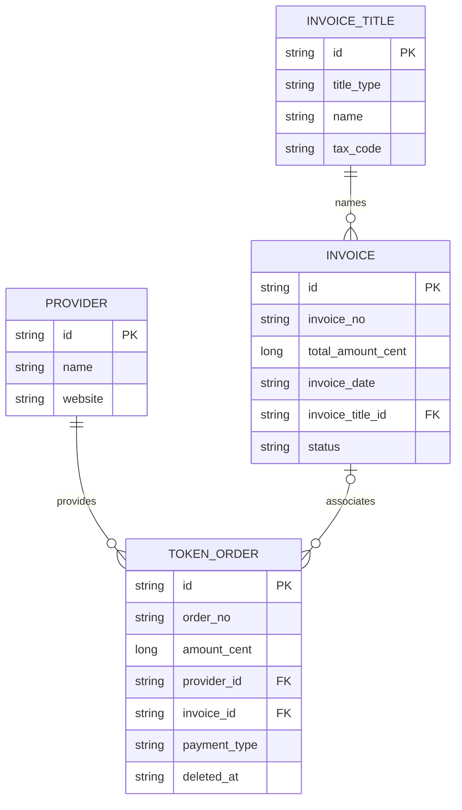
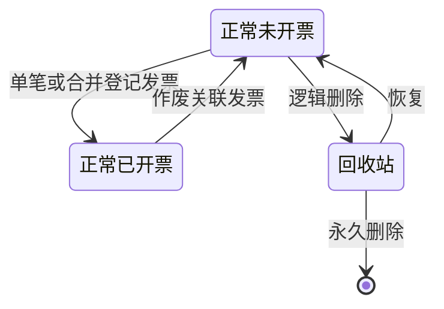

# TokenOrderMgmt 设计说明

[项目说明与运行指南](../README.md) · [接口文档](interface.md) · [页面原型](prototype/index.html)

本文面向维护者，描述当前源码的设计与实现边界，核对日期为 2026-09-08。
接口字段与完整请求示例见接口文档；安装、配置和构建方式统一见项目 README。

## 1. 目标与边界

系统用于本地记录 API Token 采购订单、提供商、发票及发票抬头。
你可以核对采购金额、登记单笔或合并发票、处理作废与回收站，并在全部记录中搜索。
“开票”表示登记已有发票信息和订单关联，不代表申请或生成电子发票文件。
系统不执行支付、Token 发放，不包含登录鉴权、云端同步或桌面安装器。

正式前端使用 React、TypeScript 和 Vite，数据通过真实 API 存入后端数据库。
原型独立保留在 `docs/prototype`，以模拟数据验证布局和交互，不作为业务数据来源。

## 2. 架构与职责



| 层次 | 当前职责 |
| --- | --- |
| 公共展示 | `components.tsx` 提供按钮、状态标签、原生弹窗、字段、表格、卡片、复制和反馈；样式集中在 `styles.css` |
| 页面协调 | `App.tsx` 管理 Hash 路由、列表快照、选择与筛选、详情、弹窗、请求顺序及提交状态 |
| 表单 | `pages/BusinessForm.tsx` 管理输入、必填提示、合计展示和业务动作提交 |
| 领域逻辑 | `domain.ts` 负责金额精度、搜索、枚举文案和动作前置校验；`types.ts` 定义实体、输入和动作类型 |
| 接口适配 | `api.ts` 统一请求、响应判断和各业务动作映射；页面不直接拼装 HTTP 请求 |
| 后端 | Controller 接收 DTO，Service 处理业务，Mapper 与 XML 访问数据库，VO 组织展示字段 |

当前前端使用 React 内置状态管理，没有独立状态库；页面与数据协调集中在 App 中。
测试数据仅由测试入口引用，生产入口不加载模拟数据，也不将业务记录保存到 localStorage。

开发时由 Vite 将同源 `/api/v1` 代理到默认 `http://127.0.0.1:8080`。
生产默认同源请求；当前后端 `resources/static` 已有前端静态资源，可由 Spring Boot 托管。
前端构建和后端静态目录之间没有自动复制流程，需要手动同步后再打包。
单独部署静态页面时，需要配置 API 反向代理，或在构建时设置完整 API 地址并配置对应 CORS。
`vite preview` 不提供开发代理；Hash 路由只解决页面定位，不解决接口转发。

## 3. 数据实体与状态



所有 ID 均为服务端生成的字符串，前端不生成业务主键。
一张发票可关联多个订单，一个订单当前最多关联一张发票；不同提供商的正常未开票订单可以合并登记。
四张表均记录创建和更新时间，订单额外使用 `deleted_at` 表示逻辑删除。

| 展示字段 / 状态 | 来源与含义 |
| --- | --- |
| `invoiceStatus` | 由订单 `invoice_id` 是否为空派生为 `UNINVOICED` / `INVOICED` |
| `deleted` | 由订单 `deleted_at` 是否为空派生为 0 / 1 |
| `invoiceType` | 沿当前发票与抬头关联取得 `PERSONAL` / `COMPANY`；未开票订单显示“—” |
| `providerName` | 根据当前提供商关联取得，不是采购时名称快照 |
| `invoiceTitleName` | 根据当前抬头关联取得，不是历史抬头快照 |
| 发票 `status` | `VALID` 为有效，`INVALID` 为作废；作废记录保留 |



前端禁止修改和删除已开票订单，禁止修改或开票回收站订单。
正常列表只提供逻辑删除；永久删除只出现在回收站。批量操作按全部选中记录校验，
不会静默跳过非法状态。恢复可单条或批量执行；回收站添加订单后进入正常列表。

发票作废由后端解除全部订单关联，并将发票标为作废。
详情通过 `GET /token-order/i/{id}` 查询当前关联，因此作废后列表为空；系统不保存历史关联快照。
修改提供商或抬头可能影响历史记录当前展示的名称、类型，不能将界面视作不可变审计凭证。

### 3.1 前后端规则差异

- 企业税号必填目前由前端强制；后端 DTO 允许空税号，因此直接调用 API 不能获得同等必填保障。
- 前端将物理删除限制在回收站，并禁止修改回收站订单；不能将这些界面限制视为后端授权控制。
- 前端检查当前快照中的重名、编号重复及记录存在性；外部并发修改后仍以服务端结果为准。
- 提供商和抬头删除不由前端预先检查引用关系。数据库声明外键，实际删除受连接约束配置影响；
  后端拒绝时展示真实错误。若存在失效引用，后端当前关联补全可能失败，前端文案回退并不能修复该查询。

## 4. 页面与交互

采用 AppleDesign 风格的系统字体、浅灰画布、白色内容层、蓝色主操作和克制阴影。
顶部导航提供订单、发票、提供商、发票抬头及全局搜索，不使用左侧导航。
订单页内切换正常列表和回收站，表单与详情使用居中弹窗。

| 路由 | 主要内容与操作 |
| --- | --- |
| `#/orders` | 订单编号、提供商、元金额、支付方式、发票状态、类型；新增、详情、修改、开票、删除及批量操作 |
| `#/trash` | 同类订单字段；详情、单条/批量恢复、永久删除及筛选 |
| `#/invoices` | 发票编号、元总金额、开票日期、类型、状态；详情、当前关联订单及有效发票作废 |
| `#/providers` | 提供商名称、不可点击的网址文字；增改、单条/批量删除、独立“访问网站”入口 |
| `#/titles` | 抬头类型、名称、税号；增改、单条/批量删除及“复制抬头” |

Hash 支持页面刷新和浏览器前进后退；切换页面清除选择与筛选。
订单和发票编号本身可复制；订单状态可进入开票或发票详情，类型可查看抬头详情。
订单详情补充更新时间和所在位置，发票详情补充抬头名称、更新时间及关联订单入口。

### 4.1 表单与复制

企业抬头必须填写税号，个人抬头选填；填写时为 15 至 20 位英文字母或数字。
新增和修改共用校验，切换类型同步更新必填提示。
抬头卡片按以下纯文本格式复制，无税号时保留第二行“税号：”，其值留空：

```text
名称：xxx
税号：xxxxxx
```

复制优先使用 Clipboard API，失败时尝试文本域复制回退；仍失败则提示手动复制。
复制结果不写入后端。系统剪贴板实际可用性依赖浏览器权限与运行环境。

### 4.2 搜索与筛选

全局搜索支持入口按钮和 `Ctrl+K` / `⌘K`，使用去除首尾空白、英文不区分大小写的子串匹配。
搜索当前加载的四类完整列表：订单编号、发票编号、提供商和抬头名称，以及订单关联的相关名称。
结果包括回收站和作废发票，不截断、不分页；不包含税号或网址搜索。
点击结果进入目标页，清除筛选、滚动定位并高亮 1 秒。

订单筛选包含更新时间、提供商、支付方式、发票状态和发票类型；
发票筛选包含更新时间、类型和状态。筛选在前端完成，不新增查询接口。
订单与发票按更新时间降序展示；全选只选择当前筛选结果。
任何完整列表未成功加载时，搜索显示加载或错误状态，不将部分记录作为完整结果。

### 4.3 滚动与可访问性

订单、发票列表采用块内滚动与固定表头，不分页且隐藏滚动条。
页面级 `html`、`body` 同样隐藏滚动条，未禁用滚动，保留滚轮、触控及键盘行为。
表格滚动容器可聚焦并带有说明，按钮、复选框和字段提供语义标签。
原生 `dialog` 管理模态焦点，非提交状态可通过 Escape 或遮罩关闭，关闭后恢复原焦点。
样式覆盖减少动画、减少透明度和增强对比度偏好；实际读屏和不同浏览器手感需独立验证。

## 5. 接口交互与一致性

统一请求前缀默认为 `/api/v1`，支持 GET、POST、PUT 和携带 JSON 请求体的 DELETE。
成功必须同时满足 HTTP 成功状态和响应体 `code === 200`；错误优先显示服务端 `message`。
请求使用 15 秒超时，列表检查数组形状、详情检查对象及字符串 ID。
这些是边界检查，不是完整运行时字段模式验证。

初次加载和每次写入后的刷新均并发读取提供商、抬头、订单与发票，全部成功后替换前端快照。
四次读取没有服务端快照事务保证，不承诺多客户端之间强一致。
详情另行查询；发票详情同时读取发票与关联订单。
列表和详情使用请求序号忽略过期响应，避免较慢旧请求覆盖较新结果。

| 场景 | 界面处理 |
| --- | --- |
| 初次读取失败 | 显示错误和重试，不伪装为空列表 |
| 明确写入失败 | 保留表单和输入，显示失败原因 |
| 网络、超时或写入响应无法解析 | 提示写入结果未确认，先刷新核对；不自动重试写入 |
| 写入成功 | 关闭已提交弹窗、清除选择，再读取完整列表 |
| 保存成功但刷新失败 | 提示“操作已保存”，重试仅重新读取，避免重复提交 |
| 详情读取失败 | 保持错误状态并提供详情重试 |

提交使用同步引用锁和忙碌状态阻止重复操作；前端不实施乐观删除或虚报批量成功条数。
底部“刷新数据”手动读取外部变更，没有后台轮询、推送订阅、幂等键或版本冲突协议。
后端负责持久化与事务，前端锁仅约束当前页面，不能阻止其他客户端同时操作。

### 5.1 金额与日期

金额在前端计算与后端存储中使用整数分，界面使用元和两位小数。
输入用十进制字符串转换为整数分，禁止非正数、多于两位小数和超过安全精度的值。
格式化使用整数商余数，不以浮点 `toFixed` 作为金额精度依据。
订单 DTO 的 `amount` 按接口约定提交 JSON 元金额，提交前检查序列化后的元分精确往返。
发票按订单整数分合计提交 `totalAmountCent`；当前后端会重新计算所选订单合计，
并检查长整数溢出，以后端计算结果为准。

开票日期为 `yyyy-MM-dd`，前端校验日期有效且不晚于浏览器本地今天。
更新时间为后端无时区的 LocalDateTime，界面不作 UTC 转换。
筛选比较更新时间的日期部分，包含起止日期全天；缺失更新时间的记录不匹配日期范围。
跨时区使用需统一客户端与服务端约定，当前没有时区配置或自动纠偏。

### 5.2 安全与运行边界

当前没有鉴权接口、用户隔离或角色权限，适用于受控本地环境，不构成开放公网服务方案。
开发前端默认绑定 `127.0.0.1`；后端的可访问范围需由实际服务与网络配置确认。
`VITE_` 前缀环境变量可进入浏览器构建产物，不能存放密码或密钥。
`API_PROXY_TARGET` 仅供开发服务器配置代理使用，不作为浏览器环境变量注入。
提供商网址只允许 HTTP / HTTPS，外链新窗口使用 `rel="noreferrer"`；业务文本由 React 渲染。
界面输入校验、按钮禁用和 CORS 均不能代替服务端业务校验与访问控制。

## 6. 原型、验证与维护

| 项目 | 页面原型 | 正式前端 |
| --- | --- | --- |
| 用途 | 确认视觉与交互 | 使用真实服务管理记录 |
| 数据 | 示例数据，可重置 | 后端 API 与 SQLite |
| 持久化 | 浏览器 localStorage，受浏览器本地文件策略影响 | 后端持久化，前端不保存业务数据 |
| 打开方式 | 浏览器直接打开原型入口 | Vite 开发或部署构建产物 |
| 关联订单 | 模拟查询 | `GET /token-order/i/{id}` |
| 维护 | 独立目录、构建和测试 | 生产工程独立构建和测试 |

原型与正式实现不是自动同步关系；后续正式页面操作以正式源码为准。
正式前端测试分为接口适配、领域逻辑、公共组件和应用交互四类，
通过模拟接口边界验证，不监听端口、不操作业务数据库。
覆盖响应失败与超时、DELETE 请求体、金额精度、企业税号、批量状态限制、重复提交、
保存成功刷新失败、作废后重新加载、关联订单、日期筛选、搜索定位及抬头两行复制。

项目提供 TypeScript 检查、Lint、Vitest 和生产构建命令，具体命令与验证记录见项目 README。
自动化 DOM 测试不等同于真实浏览器视觉、系统剪贴板、读屏、后端 CORS 或真实数据库联调。
当前文档不将这些尚需独立验收的项目描述为已通过。
维护时须同步检查接口契约、前后端规则差异和静态资源版本，避免只更新源码而部署旧产物。
